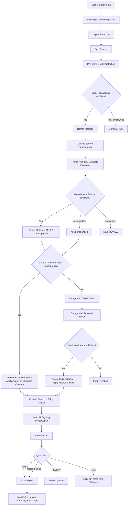

# MTKrita End-to-End Workflow Specification

## Status
SSOT — Workflow Baseline v1.1

## Purpose
กำหนด workflow มาตรฐานของ MTKrita ตั้งแต่รับ Sticker Sheet จนได้ PNG รายเฟรม พร้อม QA, manifest และ evidence โดยรวม happy path, alternate path, review path และ failure path ไว้ในเอกสารเดียว

## 1. Primary Workflow

## 2. Mandatory Stage Order
Unless an approved ADR states otherwise, critical stages execute in this order:

1. inspect source and fingerprint
2. detect/infer layout
3. split frames
4. detect/remove frame border where safe
5. classify **source transparency provenance** before alpha-generating cleanup
6. detect frame-number metadata and produce cleanup mask/evidence
7. if source transparent: preserve source alpha and apply approved metadata cleanup
8. if source opaque: background removal remains mandatory; metadata-generated alpha must not alter routing
9. analyze content/edge safety
10. smart-fit without default upscaling
11. QA
12. export PNG
13. write manifest/evidence

## 3. Happy Path — Transparent Sheet
1. valid source is accepted
2. frames are split correctly
3. border is removed when confidently detected
4. source transparency is classified before metadata cleanup
5. metadata cleanup is applied while preserving original alpha semantics
6. background removal is bypassed
7. content passes safety checks
8. PNG is exported
9. frame becomes PASS or AUTO_FIXED

## 4. Happy Path — Opaque Sheet
1. valid source is accepted
2. frames are split
3. border is removed when safe
4. frame is classified as opaque before any alpha-generating metadata cleanup
5. metadata detector emits mask/evidence without changing source routing provenance
6. background classifier selects a deterministic provider where possible
7. provider generates foreground alpha mask
8. approved metadata mask is applied to the resulting alpha/output
9. mask passes confidence/safety checks
10. PNG is exported as RGBA

## 5. Alternate Flows

### AF-01 Non-divisible/resized grid
If configured geometry does not divide evenly, the splitter shall invoke hybrid separator/layout refinement. It shall not guess frame coordinates destructively.

### AF-02 No border present
No removal occurs; finding records `BORDER_NOT_PRESENT` or equivalent informational evidence.

### AF-03 No frame number present
No metadata removal occurs; frame continues unchanged.

### AF-04 Fully opaque alpha channel
RGBA mode alone is not evidence of meaningful transparency. Fully opaque alpha routes to background removal.

### AF-05 Already transparent frame
Background segmentation is skipped by default based on source transparency provenance.

### AF-06 Metadata cleanup creates transparency
Transparency introduced by metadata cleanup is not considered source transparency and shall not change an opaque frame to the transparent route.

## 6. REVIEW Flows
A frame must route to REVIEW when a destructive decision is uncertain, including:
- ambiguous border/artwork contact
- ambiguous frame-number candidate
- background/foreground similarity with insufficient confidence
- suspicious edge clipping
- significant requested upscaling
- unexpected layout geometry

REVIEW is a safe operational state, not an error by itself.

## 7. Failure Flows
FAIL is reserved for conditions where processing cannot safely continue, such as:
- unreadable/corrupt input
- unsupported critical format condition
- impossible frame geometry
- output write failure after retry policy
- invariant violation that could compromise source/output integrity

## 8. Source Preservation
The source file is immutable by default. All output and intermediates belong to a job-specific workspace. Source SHA-256 must remain unchanged through the job.

## 9. Idempotency Requirement
Re-running the same deterministic job with the same source/config/engine version shall produce equivalent deterministic outputs and shall not accumulate transformations from prior outputs.

## 10. Transparency Provenance Contract
The manifest/evidence model must distinguish:
- source/extracted-frame transparency state
- alpha introduced by metadata cleanup
- alpha produced by background removal
- final alpha state

Routing decisions must use source transparency provenance, not final/intermediate alpha created by cleanup stages.

## 11. Completion Contract
A job is complete only when every expected frame is in a terminal state (`PASS`, `AUTO_FIXED`, `REVIEW`, `FAIL`) and the manifest records source identity, configuration identity, stage findings, actions and output references.

## References
- `MASTER_PROJECT_CONTROL.md`
- `24_MVP_MINIMUM_FUNCTIONAL_BASELINE.md`
- `04_IMAGE_PROCESSING_PIPELINE.md`
- `17_PIPELINE_ENGINEERING_GUIDE.md`
- `06_QA_RULEBOOK.md`
- `DECISIONS.md` ADR-023
