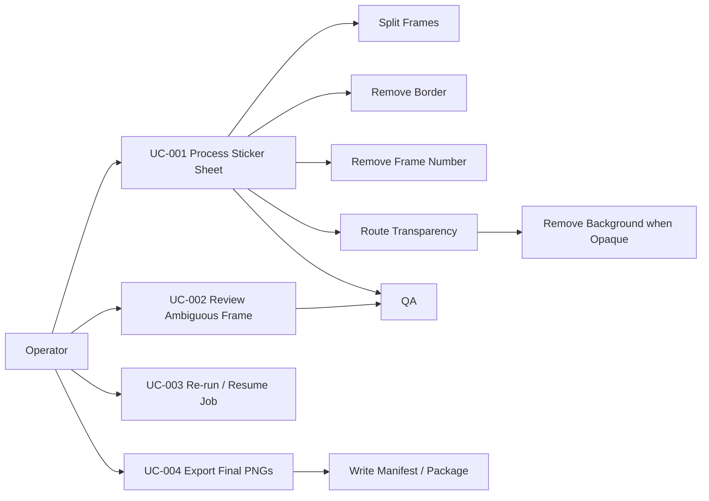

# MTKrita Use Case Specification

## Status
SSOT — Use Case Baseline v1.0

## Actors
- **Operator** — ผู้ใช้หลักที่นำ Sticker Sheet เข้าระบบ ตรวจ REVIEW และ export
- **MTKrita Orchestrator** — Python control plane ที่ดำเนิน workflow
- **Image Processing Provider** — OpenCV/Pillow/optional providers
- **QA Engine** — ตรวจผลตาม rulebook
- **Filesystem / Windows Runtime** — จัดเก็บ source, workspace, outputs
- **Optional Krita Review Station** — manual correction สำหรับ REVIEW

## Use Case Diagram

## UC-001 — Process Sticker Sheet
**Primary actor:** Operator  
**Trigger:** Operator selects/drops a Sticker Sheet.  
**Preconditions:** source is readable; output workspace is available.  
**Main flow:** inspect → layout detect → split → border removal → number removal → transparency routing → optional background removal → content analysis → smart fit → QA → export/evidence.  
**Postconditions:** expected frames exist in terminal states and manifest is written.  
**Exceptions:** unreadable input, ambiguous layout, write failure, destructive uncertainty.

## UC-002 — Review Ambiguous Frame
**Primary actor:** Operator  
**Trigger:** frame enters `REVIEW`.  
**Preconditions:** source frame and evidence are preserved.  
**Main flow:** show before/after/mask/findings → operator chooses approve, retry with override, manual edit, or reject → re-QA.  
**Postconditions:** frame returns to PASS/AUTO_FIXED/REVIEW/FAIL with audit trail.  
**Rule:** review actions may not overwrite original source.

## UC-003 — Re-run / Resume Job
**Primary actor:** Operator / Orchestrator  
**Trigger:** interrupted job or explicit retry.  
**Preconditions:** source hash/config/version are known.  
**Main flow:** read manifest → validate source identity → skip completed deterministic stages where artifacts are valid → resume remaining stages.  
**Postconditions:** no duplicated destructive transformations; evidence remains traceable.

## UC-004 — Export Final PNGs
**Primary actor:** Operator  
**Trigger:** eligible frames are ready.  
**Preconditions:** export profile is valid.  
**Main flow:** validate profile → export deterministic PNG names → verify outputs → write manifest/package summary.  
**Postconditions:** output files are traceable to source sheet/frame.

## UC-005 — Process Already-Transparent Frame
**Primary actor:** Orchestrator  
**Trigger:** alpha analysis finds meaningful transparency.  
**Main flow:** preserve alpha → skip background segmentation → continue content/QA/export.  
**Postconditions:** existing transparency is not needlessly regenerated.

## UC-006 — Process Opaque Frame
**Primary actor:** Orchestrator  
**Trigger:** RGB or fully opaque RGBA frame.  
**Main flow:** classify background → choose provider → create/refine mask → confidence/safety check → RGBA output.  
**Alternate:** low confidence → REVIEW.

## UC-007 — Remove Frame Border
**Primary actor:** Orchestrator  
**Trigger:** extracted frame ready for border analysis.  
**Main flow:** analyze edges → estimate color/thickness/continuity → calculate confidence → remove only if safe.  
**Alternate:** uncertain artwork contact → REVIEW / keep unchanged.

## UC-008 — Remove Frame Number / Sheet Metadata
**Primary actor:** Orchestrator  
**Trigger:** metadata zone is configured.  
**Main flow:** detect compact candidate in zone → distinguish from artwork → remove via mask if confidence high.  
**Alternate:** multiple/ambiguous candidates → REVIEW or no removal.

## UC-009 — Batch Process 40 Stickers
**Primary actor:** Operator  
**Trigger:** four 10-frame sheets submitted.  
**Main flow:** create parent batch → process each sheet/job → maintain global ordering → aggregate QA → export 40 assets/package.  
**Postconditions:** every output maps to sheet/frame/index and batch manifest.

## UC-010 — Handle Processing Failure
**Primary actor:** Orchestrator / Operator  
**Trigger:** stage raises recoverable or terminal error.  
**Main flow:** classify error → retry if allowed → preserve evidence → REVIEW/FAIL if unresolved.  
**Postconditions:** no silent loss, no source overwrite, failure reason recorded.

## Acceptance Rule
Every mandatory MVP capability must map to at least one use case and at least one objective test in the traceability matrix.
