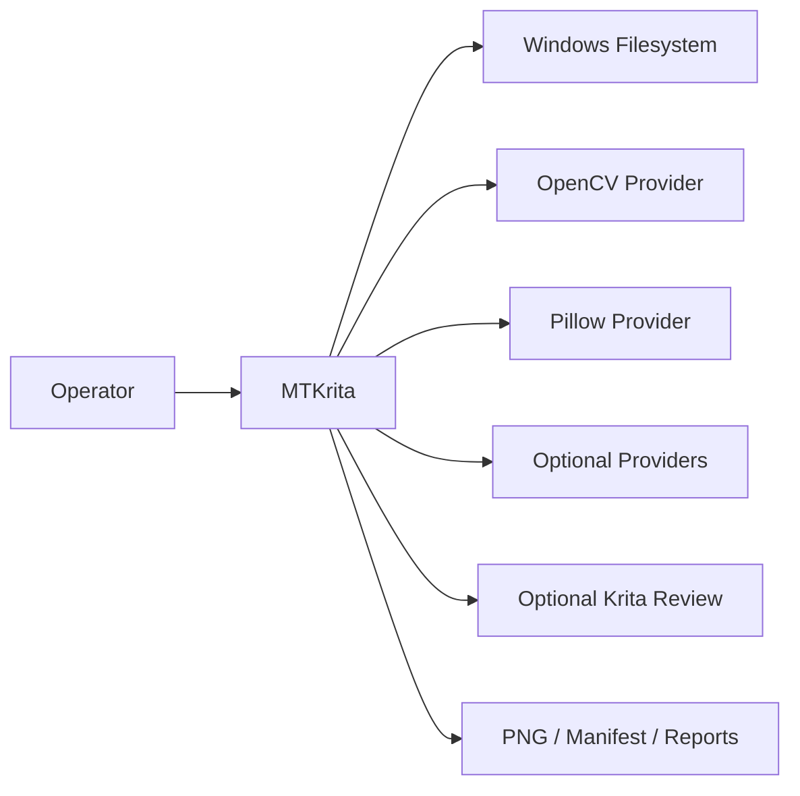
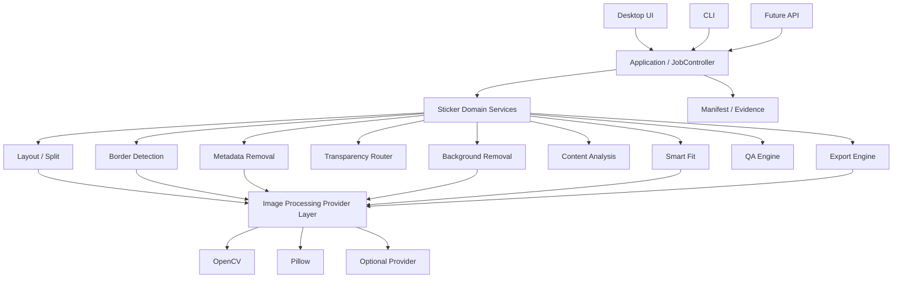
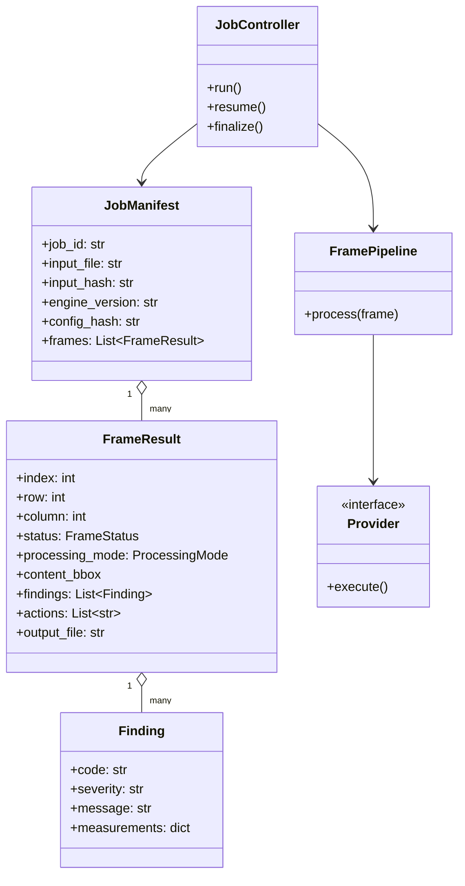
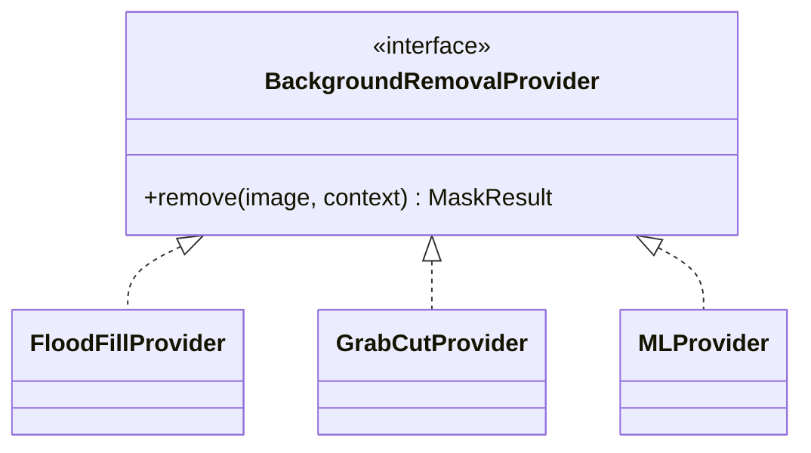
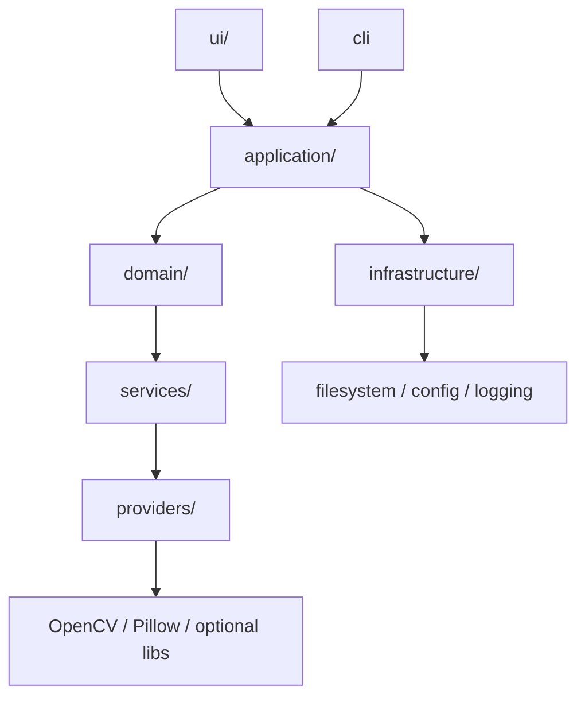

# MTKrita UML System Model

## Status
SSOT — UML Architecture Baseline v1.0

## 1. System Context

## 2. Component Diagram

## 3. Core Domain Class Model

## 4. Provider Interface Model

The same replaceable-provider principle applies to layout, metadata, export and other engine-backed operations where practical.

## 5. Package Dependency Rule

### Dependency constraints
- UI must not contain sticker-processing business rules.
- Domain must not depend on UI.
- Provider-specific APIs must not leak through domain contracts unless explicitly documented.
- Core pipeline must remain headless-capable.
- Krita must remain optional for MVP/core runtime.

## 6. Responsibility Boundaries
- **JobController** owns job-level orchestration and evidence.
- **FramePipeline** owns frame-level stage sequencing.
- **Domain services** own sticker-specific decisions.
- **Providers** own low-level image operations.
- **QAEngine** owns rule evaluation, not image modification.
- **AutoFixEngine** may modify only operations explicitly classified as safe.
- **ExportEngine** owns output profile validation and deterministic serialization.

## 7. Architecture Invariant

> Domain intent controls providers; providers must not redefine domain behavior.

References: `03_SYSTEM_ARCHITECTURE.md`, `25_DOCUMENT_DRIVEN_SSOT_OPERATING_MODEL.md`, `DECISIONS.md`.
