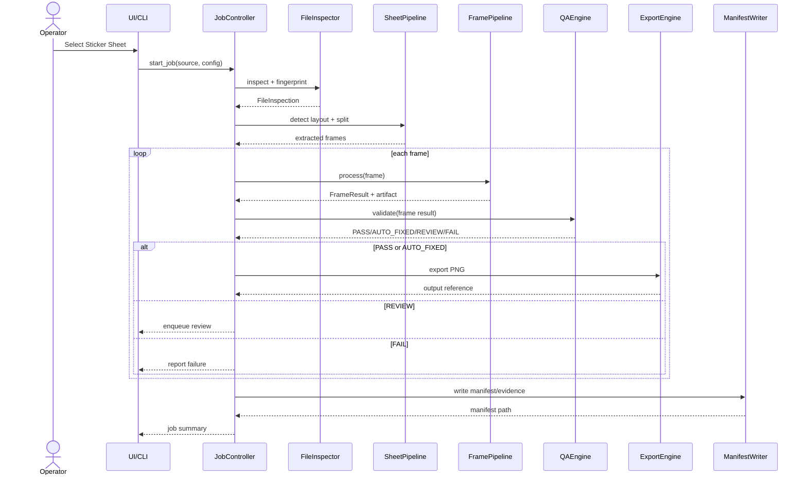
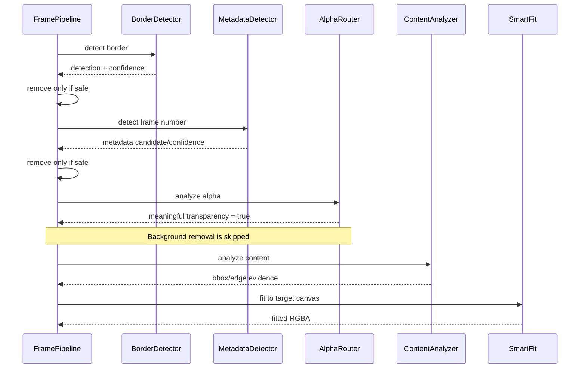
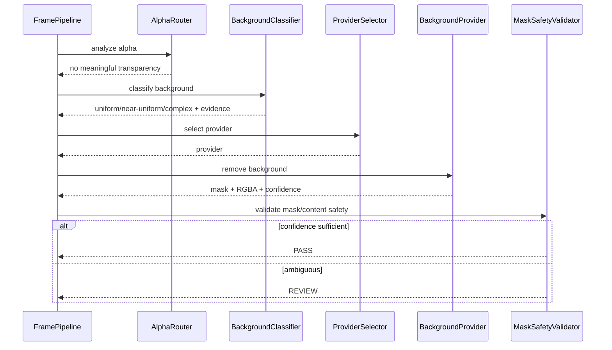
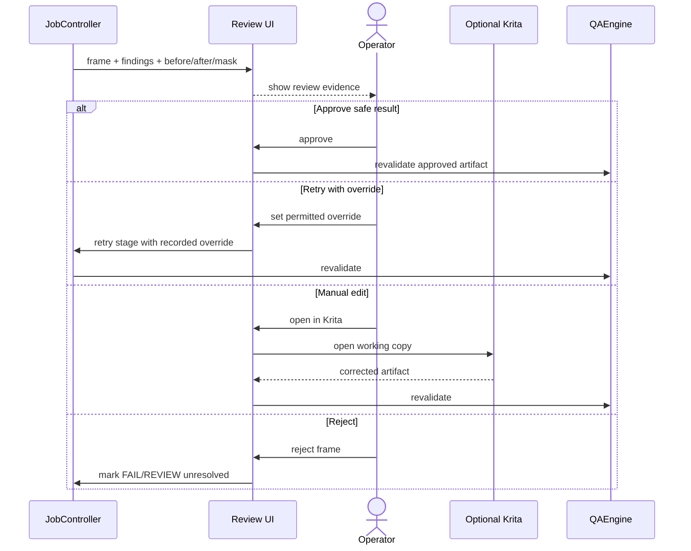
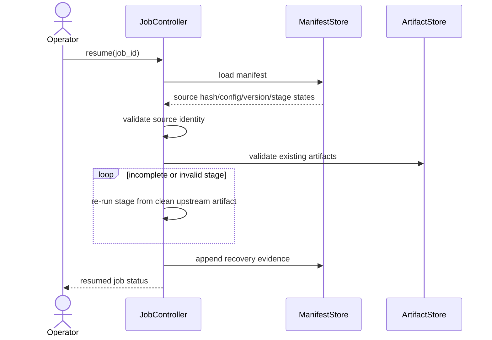

# MTKrita Sequence Diagrams

## Status
SSOT — Sequence Baseline v1.0

## 1. Main Processing Sequence

## 2. Transparent Frame Sequence

## 3. Opaque Frame Sequence

## 4. REVIEW Sequence

## 5. Resume/Recovery Sequence

## Sequence Rule
All destructive or state-changing operations must return explicit evidence and must not be considered successful solely because no exception was raised.
