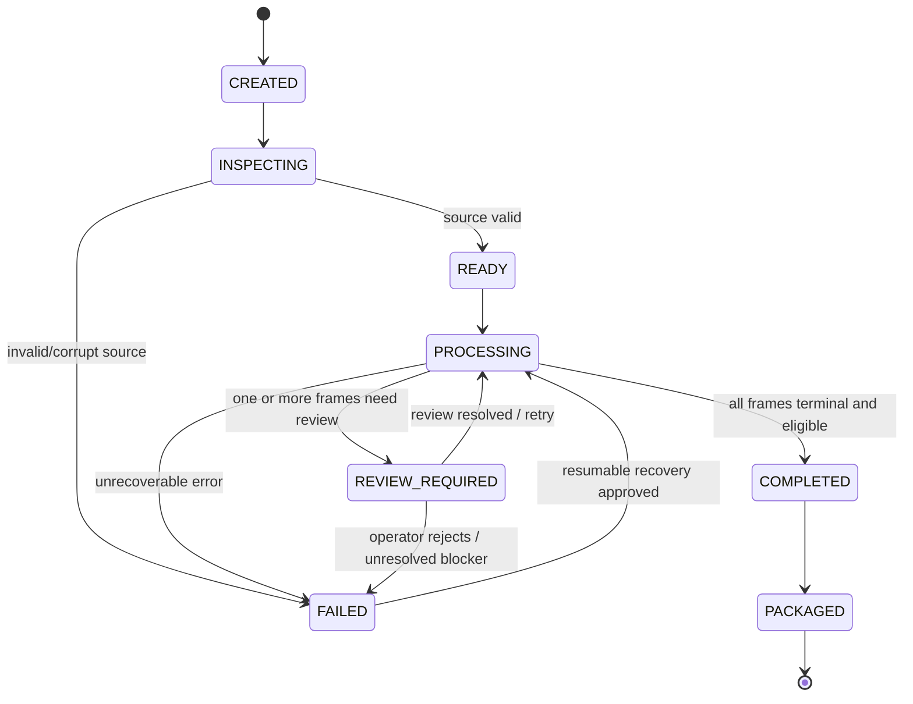
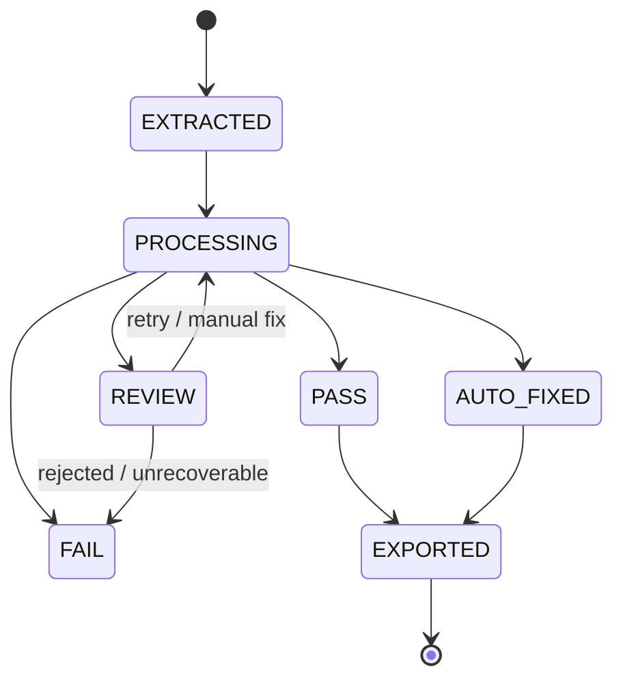

# MTKrita State Machine Specification

## Status
SSOT — State Model Baseline v1.0

## 1. Job State Machine

## 2. Frame State Machine

## 3. Stage State Model
Each critical stage may record one of:
- `PENDING`
- `RUNNING`
- `SUCCEEDED`
- `SKIPPED`
- `REVIEW`
- `FAILED`

`SKIPPED` must include an explicit reason, e.g. `BACKGROUND_REMOVAL_SKIPPED_MEANINGFUL_ALPHA`.

## 4. Transition Rules
- transitions must be explicit and persisted in manifest/evidence
- terminal frame status cannot silently return to processing without a recorded retry/review action
- a retry must start from a known clean upstream artifact, not from already transformed output unless the stage contract explicitly permits it
- `FAIL` may be recoverable only when error classification says retry/resume is allowed
- `COMPLETED` job requires all expected frames to be terminal and manifest to be consistent

## 5. Invariants
1. source hash never changes during job
2. frame index identity never changes after extraction
3. each frame has at most one active processing attempt at a time
4. exported artifacts map to exactly one source sheet/frame/index
5. destructive uncertainty may transition to REVIEW, never directly to PASS
6. background removal may be `SKIPPED` only when routing evidence exists

## 6. Retry Counter / Attempt Identity
Each retryable stage should record:
- `attempt_id`
- `attempt_number`
- start/end timestamp
- provider/strategy
- config hash
- outcome
- error/finding codes

## 7. Batch State
A multi-sheet batch may use:
- `BATCH_CREATED`
- `BATCH_PROCESSING`
- `BATCH_REVIEW_REQUIRED`
- `BATCH_FAILED`
- `BATCH_COMPLETE`
- `BATCH_PACKAGED`

Batch completion does not override unresolved frame REVIEW/FAIL states.

## 8. UI Mapping
UI must display state using domain status rather than infer status from file existence. A PNG existing on disk is not sufficient evidence that the frame is PASS.

References: `27_END_TO_END_WORKFLOW_SPEC.md`, `33_ERROR_RECOVERY_AND_IDEMPOTENCY_SPEC.md`.
