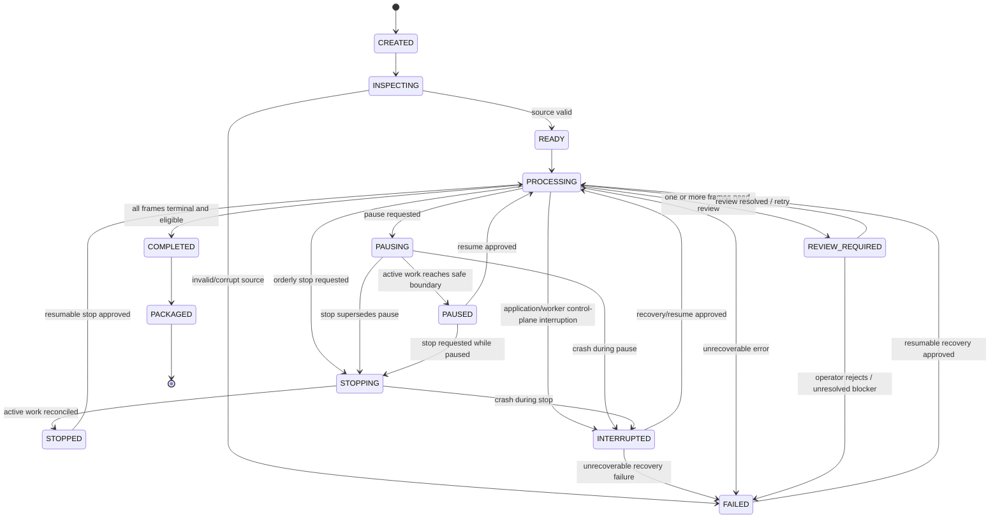
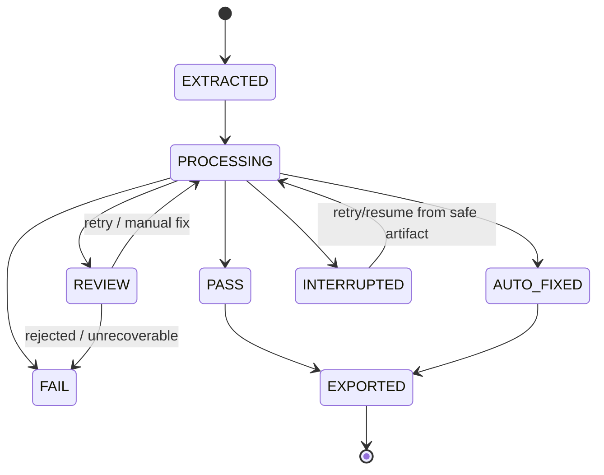

# MTKrita State Machine Specification

## Status
SSOT — State Model Baseline v1.1

## 1. Job State Machine

### Job Control-State Semantics
- `PAUSING` means admission of new tasks has stopped while active work is allowed to reach an approved safe boundary.
- `PAUSED` is durable and resumable. No new task may be scheduled while a job is PAUSED.
- `STOPPING` means orderly termination is in progress. Existing work is reconciled before the job becomes STOPPED.
- `STOPPED` is durable. Resume is permitted only when policy and persisted checkpoints say the job is resumable.
- `INTERRUPTED` is used for unexpected process/application interruption or startup reconciliation of previously active work. It is not equivalent to FAIL.
- startup recovery must never infer `COMPLETED` from artifact existence alone.

## 2. Frame State Machine

## 3. Task State Model
Each scheduled unit of work uses:
- `PENDING`
- `RUNNING`
- `SUCCEEDED`
- `REVIEW`
- `FAILED`
- `INTERRUPTED`

Rules:
- only one `(worker_id, attempt)` may be authoritative for a RUNNING task;
- a new attempt must strictly supersede the previous attempt number;
- stale or expired attempts cannot commit task success or authoritative artifacts;
- startup reconciliation converts orphaned RUNNING tasks to INTERRUPTED before requeue/resume decisions;
- a PAUSED/STOPPED/INTERRUPTED job may contain terminal tasks that remain reusable when input/config/provider identity still matches.

## 4. Stage State Model
Each critical stage may record one of:
- `PENDING`
- `RUNNING`
- `SUCCEEDED`
- `SKIPPED`
- `REVIEW`
- `FAILED`
- `INTERRUPTED`

`SKIPPED` must include an explicit reason, e.g. `BACKGROUND_REMOVAL_SKIPPED_MEANINGFUL_ALPHA`.

## 5. Transition Rules
- transitions must be explicit and persisted in JobStore/manifest/evidence
- terminal frame status cannot silently return to processing without a recorded retry/review action
- a retry must start from a known clean upstream artifact, not from already transformed output unless the stage contract explicitly permits it
- `FAIL` may be recoverable only when error classification says retry/resume is allowed
- `INTERRUPTED` records infrastructure/lifecycle interruption and must not be misreported as deterministic processing failure
- `PAUSED` and `STOPPED` require no authoritative RUNNING task for that job
- `COMPLETED` job requires all expected frames/tasks to be terminal and manifest/artifact evidence to be consistent
- user-facing UI issues control requests; only domain/control-plane services persist authoritative state transitions

## 6. Startup Reconciliation Rules
On application startup:
1. load durable JobStore state;
2. identify jobs in `PROCESSING`, `PAUSING`, or `STOPPING` from the previous process;
3. identify RUNNING tasks whose workers no longer exist;
4. mark those tasks `INTERRUPTED` using durable CAS rules;
5. transition affected jobs to `INTERRUPTED` unless a stricter recovery policy applies;
6. verify committed artifact hashes/checkpoints before allowing reuse;
7. expose explicit resume/retry actions; do not schedule work before reconciliation completes.

Jobs already in `PAUSED`, `STOPPED`, `REVIEW_REQUIRED`, `FAILED`, `COMPLETED`, or `PACKAGED` remain in their durable state unless validation finds a separate integrity error.

## 7. Invariants
1. source hash never changes during job
2. frame index identity never changes after extraction
3. each frame/task has at most one authoritative processing attempt at a time
4. exported artifacts map to exactly one source sheet/frame/index
5. destructive uncertainty may transition to REVIEW, never directly to PASS
6. background removal may be `SKIPPED` only when routing evidence exists
7. no stale attempt may mutate authoritative job/task/artifact state
8. no job may enter PAUSED/STOPPED/COMPLETED while authoritative RUNNING tasks remain

## 8. Retry Counter / Attempt Identity
Each retryable task/stage should record:
- `attempt_id` or stable task id + `attempt_number`
- worker identity
- lease expiry
- start/end timestamp
- provider/strategy
- config hash
- input artifact hash
- outcome
- error/finding codes

## 9. Batch State
A multi-sheet batch may use:
- `BATCH_CREATED`
- `BATCH_PROCESSING`
- `BATCH_PAUSING`
- `BATCH_PAUSED`
- `BATCH_REVIEW_REQUIRED`
- `BATCH_INTERRUPTED`
- `BATCH_FAILED`
- `BATCH_COMPLETE`
- `BATCH_PACKAGED`

Batch completion does not override unresolved frame REVIEW/FAIL states.

## 10. UI Mapping
UI must display state using domain status rather than infer status from file existence. A PNG existing on disk is not sufficient evidence that the frame is PASS. UI must not mutate worker or JobStore state directly; it submits control commands to MainBoard/JobController.

References: `27_END_TO_END_WORKFLOW_SPEC.md`, `33_ERROR_RECOVERY_AND_IDEMPOTENCY_SPEC.md`, `47_MAINBOARD_INTERNAL_COMMUNICATION_ARCHITECTURE.md`, `48_BATCH_MULTIWORKER_EXECUTION_MODEL.md`, `49_RELIABILITY_RECOVERY_OBSERVABILITY_SPEC.md`.
