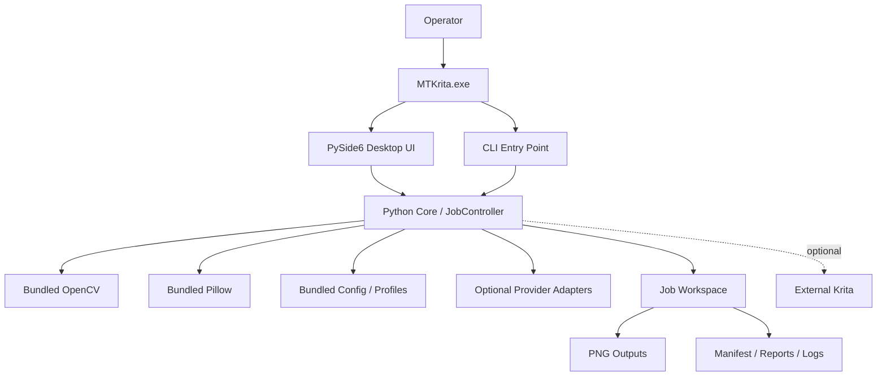

# MTKrita Deployment and Runtime Architecture

## Status
SSOT — Deployment Baseline v1.0

## 1. Target Platform
- Windows 11 x64 production target
- standalone application/installer
- portable technical build
- no end-user Python installation required

## 2. Deployment Diagram



## 3. Runtime Boundaries
- GUI and CLI call the same core application services.
- Core processing is headless-capable.
- OpenCV/Pillow are implementation providers, not application entry points.
- Krita is external/optional and is never required for normal automated processing.
- source files remain outside mutable job workspaces.

## 4. Recommended Windows Layout

```text
C:\Program Files\MTKrita\
  MTKrita.exe
  runtime\
  configs\
  licenses\

%LOCALAPPDATA%\MTKrita\
  settings\
  logs\
  cache\

User-selected workspace\
  jobs\<job_id>\
    manifest.json
    frames\
    intermediates\
    outputs\
    reports\
```

## 5. Build/Packaging Strategy
Preferred initial stack:
- PyInstaller or Nuitka for standalone executable
- Inno Setup or equivalent for installer
- GitHub Actions Windows runner for repeatable CI/build verification

Final technology choice requires an ADR before v1.0 packaging is frozen.

## 6. Clean-Machine Acceptance
Release candidate must be tested on a clean Windows 11 x64 environment where Python/OpenCV/developer tools are not preinstalled.

Acceptance includes:
- application starts
- sample sheet can be processed
- required provider libraries load
- output and reports can be written
- uninstall/portable behavior is documented

## 7. Update/Versioning
Every build must expose:
- application version
- engine version
- config/profile version
- dependency inventory
- build identifier/commit

## 8. Security Boundary
Input image files are untrusted external data. Parsing and processing failures must be isolated to the job and must not overwrite arbitrary user files.

References: `18_WINDOWS_DISTRIBUTION_PLAN.md`, `36_SECURITY_AND_FILE_SAFETY_MODEL.md`.
