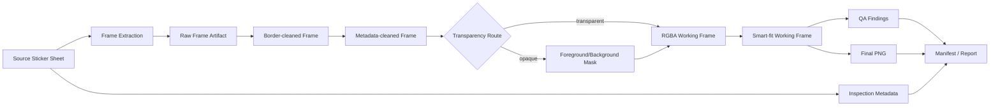

# MTKrita Data Flow and Artifact Lifecycle

## Status
SSOT — Data Flow Baseline v1.0

## 1. Data Flow Diagram



## 2. Artifact Classes

### A0 Source Artifact
Original user-provided Sticker Sheet. Immutable.

### A1 Inspection Record
Dimensions, format, mode, alpha statistics, SHA-256, source path reference.

### A2 Raw Extracted Frame
Pixel-coordinate crop from source sheet before per-frame cleanup.

### A3 Border-Cleaned Frame
Working artifact after high-confidence border removal or unchanged if no safe removal.

### A4 Metadata-Cleaned Frame
Working artifact after frame-number/sheet-metadata removal or unchanged if no safe removal.

### A5 Mask Artifact
Optional artifact for opaque background removal. May include foreground mask, confidence map, provider evidence.

### A6 RGBA Working Frame
Transparent working representation after routing/background processing.

### A7 Smart-Fit Frame
Canvas-adjusted working representation prepared for QA/export.

### A8 Final PNG
Verified export artifact produced under output profile.

### A9 Evidence Artifacts
Manifest, findings, logs, human-readable summary, optional previews/masks.

## 3. Authority by Stage
The authoritative source of truth for image content remains A0. Downstream artifacts are derived and must be reproducible/traceable.

A downstream working artifact must never replace A0.

## 4. Artifact Naming
Recommended deterministic pattern:

```text
jobs/<job_id>/
  source.json
  frames/raw/frame_001.png
  frames/border/frame_001.png
  frames/metadata/frame_001.png
  masks/frame_001.png
  frames/rgba/frame_001.png
  frames/fitted/frame_001.png
  outputs/001.png
  manifest.json
  report.json
```

Exact paths may evolve, but identity mapping must remain stable.

## 5. Artifact Hashing
Recommended hashes:
- source: mandatory SHA-256
- final exported PNG: mandatory for release evidence
- critical intermediates: optional for MVP, recommended for regression/recovery

## 6. Retention
- source: owned by user, never deleted by processing
- final outputs/manifests: retained until user removes them
- masks/intermediates: configurable retention; may be retained for REVIEW/debug and pruned after successful jobs
- temporary partial files: deleted after atomic commit/recovery evaluation

## 7. Privacy / Data Handling
The core application is local-first by design. No image should leave the machine unless an explicitly configured external/AI provider is introduced in a future approved ADR and user-facing workflow.

## 8. Quality Rule
Repeated transformations must not chain from final/exported PNG back into processing. Reprocessing starts from source/raw stage artifacts to avoid cumulative quality loss.

## 9. Traceability
Every final PNG must identify:
- job id
- source hash
- source sheet
- frame index
- processing/config version
- significant actions
- QA status

References: `33_ERROR_RECOVERY_AND_IDEMPOTENCY_SPEC.md`, `09_DATA_MODELS_AND_CONFIG.md`.
